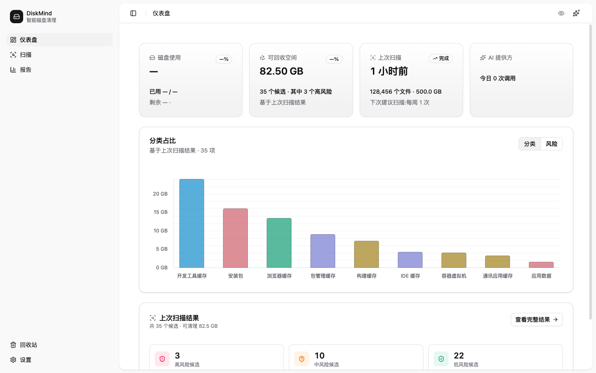
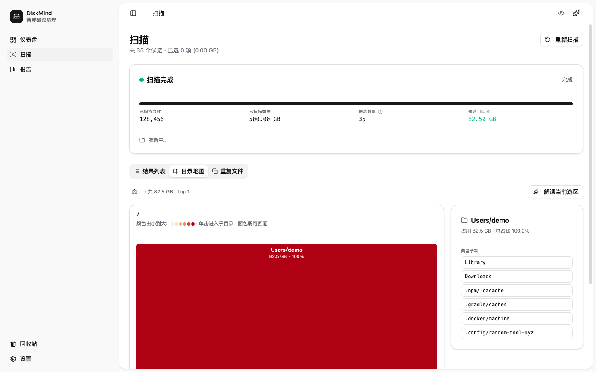
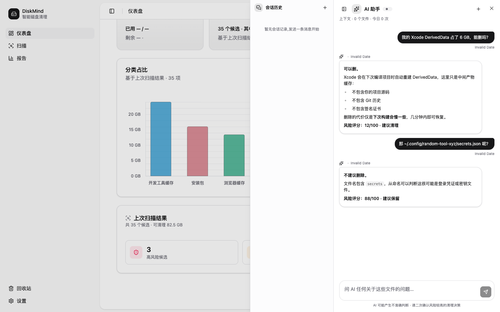
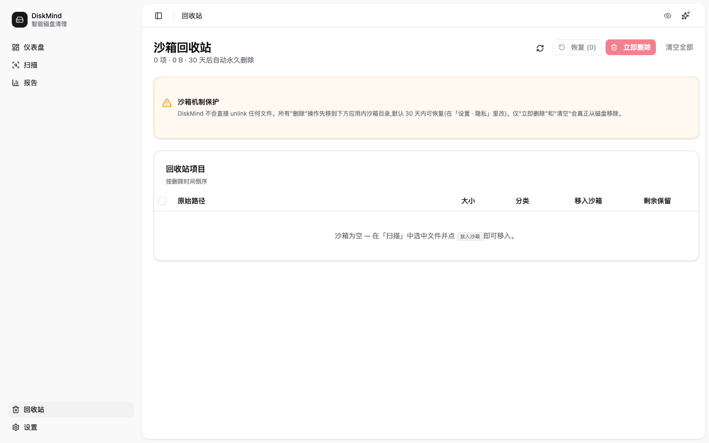

<div align="center">


# DiskMind

**用大模型重新定义磁盘清理。**

一款面向 Windows / macOS 的桌面级智能磁盘分析与清理工具。
本地扫描，AI 研判，沙箱删除，每条建议都附"为什么"。


**简体中文** · [English](./README.en.md)

[宣传页](./docs/index.html) · [可行性报告](./design/2026-05-25-DiskMind可行性分析报告.md) · [技术设计](./design/2026-05-25-02-DiskMind技术设计文档.md) · [原型设计](./design/2026-05-25-03-DiskMind原型设计.md)

</div>

---

## 一句话

> 当 CCleaner 还在比谁的规则库更大时，DiskMind 让每台电脑都有一个懂你磁盘的 AI 管家。

---

## 截图

<table>
  <tr>
    <td width="50%">
      
      <p align="center"><sub><b>Dashboard</b>：扫描总览、风险分布、Top 大文件、近一次扫描摘要</sub></p>
    </td>
    <td width="50%">
      
      <p align="center"><sub><b>磁盘地图</b>：基于 ECharts Treemap 的可视化目录占用</sub></p>
    </td>
  </tr>
  <tr>
    <td width="50%">
      
      <p align="center"><sub><b>AI 对话抽屉</b>：对任意文件追问，自然语言解释风险与建议</sub></p>
    </td>
    <td width="50%">
      
      <p align="center"><sub><b>沙箱回收站</b>：30 天可回滚，每次清理都可撤销</sub></p>
    </td>
  </tr>
</table>

---

## 为什么不是 CCleaner / CleanMyMac

| 维度 | 传统清理软件 | DiskMind |
| :--- | :--- | :--- |
| 识别方式 | 规则库匹配（路径/扩展名） | 规则库 **+** LLM 语义判定 |
| 风险评估 | 二元（可删 / 不可删） | 多级风险评分（0–100）+ 风险标签 |
| 用户认知 | 黑盒，被动信任 | 透明，每条建议附自然语言解释 |
| 长尾文件 | 难以识别非标准产物 | LLM 推断未知文件用途 |
| 隐私 | 不透明 | 仅元数据外发，可全程本地（Ollama） |
| 删除 | 直删或入系统回收站 | 应用内沙箱，30 天可回滚 |
| 平台 | Mac 与 Win 各做各的 | 一套 Tauri + Rust 统一架构 |
| 工程开放 | 闭源黑盒 | MIT 开源，103 测试全绿 |

---

## 为谁而做

DiskMind 不试图取悦所有人，而是针对四类清晰可识别的用户做差异化体验。

| 用户画像 | 占比预估 | 关键诉求 | DiskMind 的回应 |
| :--- | :---: | :--- | :--- |
| 极客 / 开发者 | 25% | 看清楚每个文件、可控、可脚本化 | JSON 输出、CSV 导出、Tauri IPC 可扩展 |
| 创意从业者（设计师 / 剪辑师） | 30% | 大文件多、缓存爆炸、需要安全释放空间 | Adobe / DaVinci / Final Cut 应用映射、Top N 大文件、沙箱回滚 |
| 普通办公用户 | 35% | 一键清理、不要误删、看得懂 | 三档策略（安全 / 谨慎 / 激进）、自然语言解释 |
| 企业 IT 管理员 | 10% | 批量、合规、可审计 | AI 调用日志、隐私上传字段可视化、未来 Enterprise 版本地 LLM 部署 |

---

## 核心能力

### 1. AI 驱动的风险研判

每个候选文件返回结构化 JSON：路径、大小、风险评分、风险等级、分类、自然语言解释、建议动作。

```json
{
  "path": "/Users/x/Library/Caches/com.adobe.AdobePhotoshop/PSCache",
  "size_mb": 4320,
  "risk_score": 12,
  "risk_level": "low",
  "category": "应用缓存",
  "explanation": "Adobe Photoshop 自动重建的缓存目录，删除后下次启动会重新生成，仅影响首次加载速度。建议清理。",
  "action": "safe_to_delete"
}
```

支持云端（DeepSeek-V3 / GPT-4o-mini / Claude Haiku）与本地（Ollama + Qwen2.5 / Phi-3.5）双轨制，可在设置里一键切换。Provider trait 抽象在 `src-tauri/src/ai/` 下，新增模型只需实现 `ChatProvider`。

### 2. 三阶段并行扫描引擎

Round 20 Scanner P0 落地，`Walk → Stat → Reduce` 三阶段流水线：

```
Walk    (单线程 WalkDir)     ──►  Vec<DirEntry>     每 200 项喷一次 progress
  ↓
Stat    (rayon par_iter)     ──►  Vec<FileEntry>    并行 metadata，closure 内 short-circuit cancel
  ↓
Reduce  (单线程)              ──►  ScanBundle       seen_inodes 去重 + bytes_total + emit
```

4-8 核期望 **3-5x 加速**。增量扫描通过 `(path, mtime, size)` 三元组复用上次 AI 分类结果，**不重复消费 LLM token**。

### 3. 沙箱化删除

所有删除先进 DiskMind 应用内回收站（独立于系统回收站），30 天保留期。事件总线驱动 `trash → scan → reports` 级联刷新，任何误操作都有 `undo`。

每次操作生成 manifest 日志（JSONL，行数封顶 1000），按 scan_run 编组，便于审计与回滚。

### 4. 全局 AI 对话

任意页面 `Cmd+L` / `Ctrl+L` 唤起右侧抽屉，对任意文件追问：

> 用户："这个 6GB 的 Xcode DerivedData 能删吗？"
> AI："可以。Xcode 会在下次编译时重建，不影响项目源码。"

会话历史持久化到 SQLite（`chat_session` + `chat_message` 两张表，LLM 自动摘要生成标题），按 scan_run 缓存 AI 清理建议，**不重复跑 LLM**。

### 5. 可视化磁盘地图

基于 ECharts Treemap 的目录占用视图，钻取式探索 + 详情面板，一眼看到"哪几个目录吃掉了 80% 的空间"。`?view=map` URL query 双向同步，可分享深链。

### 6. 隐私优先

- 不发送文件内容，只发元数据（路径 / 大小 / 修改时间 / 扩展名 / 应用归属）
- 上传字段对用户可视化审计
- 隐私模式：完全本地，零网络请求（Ollama provider）
- `excludeSensitive` 默认跳过 `.ssh / .gnupg / .aws / .kube / .docker / .npmrc`

### 7. AI 成本透明

不藏 token 账单，让用户自己算。

| 维度 | 值 |
| :--- | :--- |
| 单文件元数据 | ~80 tokens |
| 批量打包 | 50 文件 / 请求 |
| 典型扫描候选 | 5 万个待评估文件 |
| 总请求数 | ~1000 次 |
| DeepSeek-V3 成本 | **~¥0.03 / 次完整扫描** |
| Ollama 本地 | **¥0 / 完全免费** |

参考：[智能扫描可行性分析](./design/2026-05-26-01-DiskMind智能扫描可行性分析.md)。

---

## 系统上下文

```
                  ┌────────────────────┐
                  │       用户           │
                  │ (个人 / 家庭 / 企业)  │
                  └─────────┬──────────┘
                            │ 桌面 GUI
                            ▼
        ┌────────────────────────────────────┐
        │         DiskMind Desktop App        │
        │      (Tauri + Rust + Vue 3)         │
        └─────┬─────────────────┬─────────────┘
              │ HTTPS           │ Local IPC
              ▼                 ▼
   ┌──────────────────┐  ┌──────────────────┐
   │  云端 LLM 网关    │  │ 本地 Ollama      │
   │ (DeepSeek/GPT/   │  │ (Qwen2.5 / Phi)  │
   │  Claude)         │  │                  │
   └──────────────────┘  └──────────────────┘
                                              
   ┌──────────────────┐  ┌──────────────────┐
   │  规则库 CDN       │  │  使用统计上报    │
   │ (Rule Pack 增量)  │  │ (匿名 · 可关闭)  │
   └──────────────────┘  └──────────────────┘
```

---

## 技术栈

```
┌─────────────────────────────────────────────────────────┐
│  UI Layer                                                │
│    Vue 3 (script setup) · TypeScript · Vite 8            │
│    shadcn-vue (reka-ui) · ECharts · lucide-vue-next      │
│    Pinia · Vue Router · Vue I18n · Vue Sonner            │
├─────────────────────────────────────────────────────────┤
│  Desktop Shell                                           │
│    Tauri 2.11 · plugin-autostart · plugin-dialog         │
│    plugin-single-instance · plugin-log · tray-icon       │
├─────────────────────────────────────────────────────────┤
│  Core Engine (Rust, async-first)                         │
│    Scanner: walkdir + rayon (三阶段并行)                  │
│    Classifier: 规则库 + 应用映射 (19 bundle id)            │
│    AIEngine: openai / anthropic / ollama providers       │
│    Policy: 三档策略 (安全 / 谨慎 / 激进)                   │
│    Cleaner: 沙箱回收站 + 30 天回滚 + manifest 日志         │
│    Storage: SQLite (rusqlite bundled)                    │
│    HTTP: reqwest (rustls-tls)                            │
├─────────────────────────────────────────────────────────┤
│  Quality & Test                                          │
│    Vitest + Vue Test Utils · jsdom                       │
│    cargo test --lib (52 测试)                            │
│    Playwright e2e (chromium webview)                     │
└─────────────────────────────────────────────────────────┘
```

**数据库决策**：原方案 SQLite + DuckDB 双引擎，2026-05-26 评估后移除 DuckDB（Top 500 截断 + 索引下 100k 行 `GROUP BY` 亚秒返回，DuckDB 静态链接 30–50MB 包体积不划算）。聚合查询统一走 SQLite。详见 [DuckDB 评估](./design/2026-05-25-04-DuckDB介绍.md)。

### 进程模型

DiskMind 是单应用进程，内部用 Tokio + rayon 多任务调度：

| 角色 | 实现 | 数量 | 职责 |
| :--- | :--- | :---: | :--- |
| UI Process | WebView2 / WKWebView | 1 | 渲染 Vue 应用 |
| Main Process | Rust (Tauri 主进程) | 1 | IPC 路由、状态管理 |
| Scan Worker Pool | rayon par_iter | N (CPU 核数) | 并行 metadata 采集 |
| AI Worker | Tokio task | 1-2 | LLM 异步请求队列 |
| Cleaner Worker | Tokio task | 1 | 串行执行删除（保证一致性） |
| Watcher | notify crate 后台线程 | 1 (可选) | 实时变更监控 |

扫描与清理**不放在 UI 线程**，通过 channel 异步通信，避免 UI 卡顿。

---

## 项目结构

```
DiskMind/
├── app/                          # Tauri 应用
│   ├── src/                      # Vue 3 前端
│   │   ├── pages/
│   │   │   ├── dashboard/        # 扫描总览
│   │   │   ├── scan/             # 扫描配置 / 进度
│   │   │   ├── disk-map/         # ECharts Treemap
│   │   │   ├── reports/          # 历史报告 / CSV/JSON 导出
│   │   │   ├── trash/            # 沙箱回收站
│   │   │   └── settings/         # 通用 / Provider / 隐私
│   │   ├── components/           # 通用组件 (ui/* shadcn-vue)
│   │   ├── composables/          # useTheme / useScanProgress / ...
│   │   ├── stores/               # Pinia (scan / ai / trash / ...)
│   │   ├── i18n/                 # zh-CN / en-US
│   │   ├── layouts/              # AppLayout / Sidebar / TopBar
│   │   ├── lib/                  # notify / format / ...
│   │   ├── api/                  # Tauri invoke 封装
│   │   ├── router/               # Vue Router
│   │   └── App.vue
│   ├── src-tauri/                # Rust 核心
│   │   ├── src/
│   │   │   ├── scanner/          # 三阶段并行扫描器
│   │   │   ├── classifier/       # 规则分类 + 19 bundle id
│   │   │   ├── ai/               # LLM 编排 + provider
│   │   │   │   ├── openai.rs
│   │   │   │   ├── anthropic.rs
│   │   │   │   ├── ollama.rs
│   │   │   │   ├── orchestrator.rs
│   │   │   │   ├── prompts.rs
│   │   │   │   └── cost.rs
│   │   │   ├── db/               # SQLite 各域表
│   │   │   ├── commands/         # Tauri IPC 命令
│   │   │   ├── trash/            # 沙箱回收站
│   │   │   ├── platform.rs       # Mac / Win 抽象
│   │   │   └── crash_log.rs      # Panic 串行化日志
│   │   ├── Cargo.toml
│   │   └── tauri.conf.json
│   ├── test/                     # Vitest 单元测试
│   ├── e2e/                      # Playwright e2e
│   ├── package.json
│   └── vite.config.ts
├── design/                       # 设计文档 (Markdown + HTML)
│   ├── 2026-05-25-DiskMind可行性分析报告.md
│   ├── 2026-05-25-02-DiskMind技术设计文档.md
│   ├── 2026-05-25-03-DiskMind原型设计.md
│   ├── 2026-05-25-04-DuckDB介绍.md
│   ├── 2026-05-25-05-DiskMind开发待办.md
│   ├── 2026-05-26-01-DiskMind智能扫描可行性分析.md
│   ├── 2026-05-28-01-DiskMind后续迭代计划.md
│   └── html/                     # 设计文档的可阅读 HTML 版
├── docs/                         # 公开宣传站 (本 README 同款风格)
│   ├── index.html
│   └── assets/
│       ├── css/main.css
│       ├── js/main.js
│       └── img/diskmind-logo.svg
└── README.md
```

---

## 快速开始

### 环境要求

| 工具 | 版本 |
| :--- | :--- |
| Node.js | 18+ |
| pnpm | 9+ |
| Rust | 1.77.2+ |
| Tauri CLI | 2.x |
| macOS | 12+ |
| Windows | 10 1809+ |

### 安装依赖

```bash
git clone https://github.com/shetengteng/DiskMind.git
cd DiskMind/app
pnpm install
```

### 开发模式

```bash
pnpm tauri:dev          # 启动 Tauri 桌面应用（自动起 Vite dev server）
pnpm dev                # 仅前端（连接已构建的 Tauri 二进制）
```

### 类型检查

```bash
pnpm exec vue-tsc --noEmit
```

### 运行测试

```bash
pnpm test               # Vitest 单元测试 (48/48)
pnpm test:e2e           # Playwright e2e (3/3)
cd src-tauri && cargo test --lib    # Rust 单测 (52/52)
```

---

## 测试与质量

DiskMind 把"零误删神话"作为头号 KSI（关键成功要素），工程上用**三层测试基础设施**兜底。

| 层次 | 框架 | 当前数量 | 覆盖重点 |
| :--- | :--- | :---: | :--- |
| Rust 单测 | `cargo test --lib` | **92 / 92** | scanner / classifier / db / ai prompt snapshot / dedup |
| 前端单测 | Vitest + Vue Test Utils | **112 / 112** | 纯函数 / Pinia stores / 关键组件 mount |
| e2e | Playwright | **3 / 3** | 路由 / 侧栏 / 无 JS 异常 |
| **合计** | | **207 / 207 全绿** | |

每次 PR 自动跑全套；Rust prompt snapshot 测试**锁住 LLM JSON schema 字段在 prompt 中的存在性**，防止改 prompt 时静默破坏下游 JSON 解析。

---

## 构建与分发

### macOS（DMG / app）

```bash
cd app
pnpm tauri:build
# 产物：src-tauri/target/release/bundle/dmg/*.dmg
#       src-tauri/target/release/bundle/macos/*.app
```

### Windows（MSI / NSIS）

```bash
cd app
pnpm tauri:build
# 产物：src-tauri/target/release/bundle/msi/*.msi
#       src-tauri/target/release/bundle/nsis/*.exe
```

Tauri Bundler 按 `tauri.conf.json` 的 `bundle.targets: "all"` 输出当前平台所有发行格式。代码签名证书通过 `TAURI_SIGNING_*` 环境变量注入。

### 发版到 GitHub Release（CI 自动化）

仓库已配置 `.github/workflows/release.yml`,**push tag 即触发** macOS / Windows 打包并上传到 GitHub Release 草稿:

```bash
# 1. 在 tauri.conf.json 与 Cargo.toml 同步 bump 版本号
# 2. 提交版本 bump
git add app/src-tauri/tauri.conf.json app/src-tauri/Cargo.toml
git commit -m "chore: bump version to v0.2.0"

# 3. 打 tag 并推送(tag 名必须以 v 开头才会触发 workflow)
git tag -a v0.2.0 -m "Release v0.2.0"
git push origin v0.2.0

# 4. 等待 3 个矩阵作业完成(macOS aarch64 / macOS x86_64 / Windows x64)
#    GitHub → Actions → Release 流水线运行中
# 5. 完成后到 GitHub → Releases → 找到自动生成的 "DiskMind v0.2.0" 草稿
#    审查 binary + 编辑 release notes,然后点 "Publish release"
```

或手动触发(忘了 push tag、需要补发等场景):**GitHub → Actions → Release → Run workflow → 输入版本号**。

**为什么用草稿**:本版本未做签名证书(macOS DeveloperID / Windows EV Code Signing,Round 11 永久决策),Release 草稿态给你最后一次审查 binary 的机会再决定是否对外发布;直接 publish 也可以,但建议至少在本机 download 测试一遍再 publish。

**首次安装绕过未签名 binary 警告**:见 Release notes 中的「首次安装注意」段落(macOS 右键打开 / Windows SmartScreen "仍要运行")。

---

## 路线图

```
M1  Tauri 骨架 + IPC                                 ✅ 100%
M2  Scanner + Classifier + 真实数据                   ✅ 100%
M2.5 Tree 视图 + DiskMap                              ✅ 100%
M3  数据持久化 + AI Engine + 沙箱                     ✅ 100%
M4  设置功能 + 内测包                                 ✅ 100%
M5  i18n + Header + 错误监控                          ✅ 100%
M6  性能 + 重复文件检测 + 公开 Beta                   🟡 ~92%
       ├─ Scanner Rayon 三阶段并行          ✅ Round 20
       ├─ 增量扫描 Bundle diff              ✅ Round 20
       ├─ AI 清理建议按 scan_run 缓存       ✅ Round 18
       ├─ Command Palette (Cmd+K)           ✅ Round 17
       ├─ 三层测试基础设施 (207 测试)        ✅ Round 22-35
       ├─ 重复文件检测 (BLAKE3 两阶段)       ✅ Round 33
       ├─ DiskMap 嵌套层级 + 下钻            ✅ Round 32 校准
       ├─ 表格 / Tree 虚拟滚动               ✅ Round 23 / 24
       ├─ GitHub Release CI                 ✅ macOS / Windows
       └─ 覆盖率 70% + 签名 + Tauri e2e      ⏳ Beta 前
M7  公开 Beta + 创作者营销                            ⏳
M8  v1.0 正式发布 + 付费版                            ⏳
```

**当前进度**（截至 2026-05-31 Round 35C）：M1-M5 全部 100% 收官，M6 推进至 ~92%。剩余主线是覆盖率冲 70%、macOS / Windows 签名证书、Tauri driver 真机 e2e，以及 Beta 前的设备级 API Key 加密。详见 [`design/2026-05-25-05-DiskMind开发待办-98%.md`](./design/2026-05-25-05-DiskMind开发待办-98%25.md)。

---

## 设计文档

| 文档 | 内容 |
| :--- | :--- |
| [可行性分析报告](./design/2026-05-25-DiskMind可行性分析报告.md) | 市场、竞品、SWOT、商业模型、研发资源 |
| [技术设计文档 (TDS)](./design/2026-05-25-02-DiskMind技术设计文档.md) | C4 架构、IPC 契约、Schema、关键算法、签名分发 |
| [原型设计文档](./design/2026-05-25-03-DiskMind原型设计.md) | 设计系统基线、ASCII wireframe、信息架构 |
| [DuckDB 评估](./design/2026-05-25-04-DuckDB介绍.md) | 双引擎方案的"已评估 / 未采纳"记录 |
| [智能扫描可行性](./design/2026-05-26-01-DiskMind智能扫描可行性分析.md) | LLM 接入策略与成本测算 |
| [后续迭代计划](./design/2026-05-28-01-DiskMind后续迭代计划.md) | Sprint 推进路径与 Round 增量记录 |
| [开发待办](./design/2026-05-25-05-DiskMind开发待办.md) | P0 / P1 / P2 任务清单 |

设计文档的可阅读 HTML 版位于 `design/html/`。

---

## 风险与缓解

DiskMind 不假装没有风险，而是把每一项都摊在桌面上。

| 风险 | 等级 | 缓解措施 | 当前状态 |
| :--- | :---: | :--- | :--- |
| 误删核心文件 | 🔴 高 | 沙箱 + 白名单 + 30 天回滚 + manifest 审计 | ✅ Trash + Restore 已上线 |
| LLM 幻觉 | 🟠 中 | JSON Schema 强约束 + 二次规则校验 + 高风险二次确认 | ✅ `<diskmind-json>` sentinel + Schema 校验 |
| 隐私顾虑 | 🟠 中 | 本地 Ollama 模式 + 上传字段透明审计 | ✅ Provider 三选一 + AI 调用日志可导出 |
| 大厂入场 | 🟠 中 | 跨平台 + AI 深度 + 体验领先 | ⏳ 通过设计哲学差异化对抗 |
| 扫描性能 | 🟡 低 | rayon 并行 + 增量扫描 + 后台 watcher | ✅ 三阶段并行（Round 20） |
| LLM 成本失控 | 🟡 低 | 多模型可切换 + 本地 Ollama 兜底 + 结果缓存 | ✅ scan_run 级 advice 缓存 |
| 跨平台一致性 | 🟡 低 | 抽象 FS 层 + 平台特性插件 | ✅ `platform.rs` 统一接口 |
| 法律合规 | 🟠 中 | 数据出境清单 + 区域路由 | ⏳ Beta 前完成 |

---

## 安全与隐私承诺

1. **不发送文件内容**：仅元数据（路径 / 大小 / mtime / 扩展名 / 应用归属）走 LLM
2. **白名单保护**：系统关键目录 / 近 7 天活跃文件 / 用户 pin 文件，永不删除
3. **沙箱删除**：先入应用内 trash（30 天），异步真删
4. **可回滚日志**：每次操作生成 manifest，支持 `undo`
5. **隐私模式**：完全本地、零网络请求（Ollama provider）
6. **敏感目录跳过**：默认 `excludeSensitive` 跳过 `.ssh / .gnupg / .aws / .kube / .docker / .npmrc`
7. **Panic 串行化日志**：JSONL 格式 + 行数封顶 1000，启动时弹 dialog 让用户复制 / 打开 / dismiss
8. **AI 调用审计**：每次 LLM 请求记录到 `ai_call_log` 表，含真实 token 估算，可导出 CSV/JSON

---

## 贡献

DiskMind 当前处于 Alpha 阶段，欢迎以下方式参与：

- **Issue**：报告 bug、提需求、讨论设计
- **Discussion**：长期路线图、AI Prompt 工程、隐私边界
- **PR**：Rust 扫描引擎、Prompt 优化、跨平台兼容

### 开发约束

- 每个 PR 必须保持 `cargo test --lib` / `pnpm test` / `pnpm test:e2e` **三色全绿**
- 新增 LLM Prompt 必须有对应的 snapshot 测试（参考 `src-tauri/src/ai/prompts.rs`）
- 修改 IPC 契约需同步更新 [TDS §4 IPC](./design/2026-05-25-02-DiskMind技术设计文档.md)
- 改 prompt 字段需经 Schema 与下游 JSON 解析的回归测试

提交前请阅读 [技术设计文档](./design/2026-05-25-02-DiskMind技术设计文档.md) 的"工程规范"章节。

---

## 设计哲学

> 一个 AI 清理工具，第一件事不是"删得多"，而是"看得懂、敢放心删"。

DiskMind 在工程上做了几个明确的取舍：

- **可解释 > 自动化**：每次清理建议必须有自然语言"为什么"，黑盒按钮的时代过去了
- **沙箱 > 直删**：30 天回滚的代价是双倍存储，但换来零误删神话
- **元数据 > 文件内容**：哪怕用户允许，我们也不读你的文件，只读 stat
- **本地优先**：Ollama 模式是一等公民，不是"勉强支持"
- **规则库 + LLM 双轨**：规则保证基线，LLM 补长尾，**不替代彼此**
- **测试覆盖工程严谨度**：103 个测试不是炫耀，是承诺 alpha 不裸奔

---

## 许可

[MIT License](./LICENSE) © 2026 Terrell She

---

<div align="center">

**DiskMind** · 看得懂、敢放心删
[GitHub](https://github.com/shetengteng/DiskMind) · [宣传页](./docs/index.html) · [设计文档](./design/) · [English README](./README.en.md)

</div>
