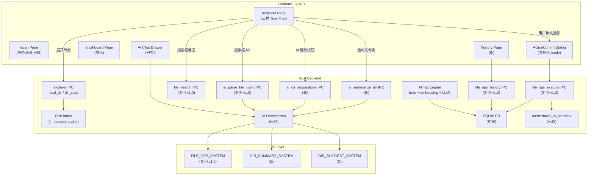
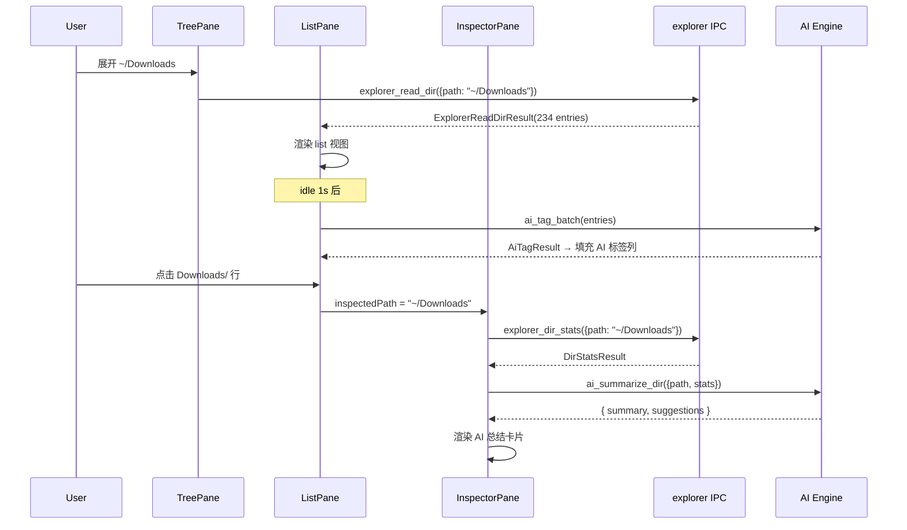
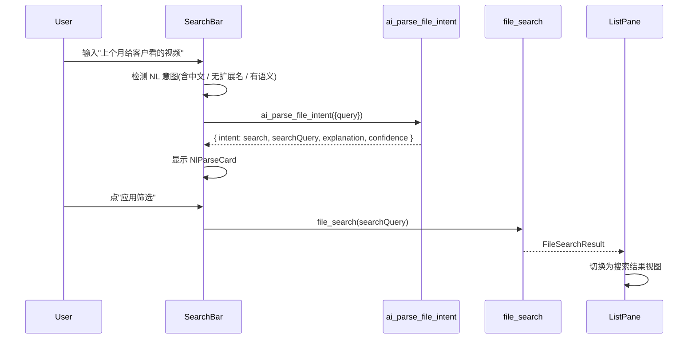
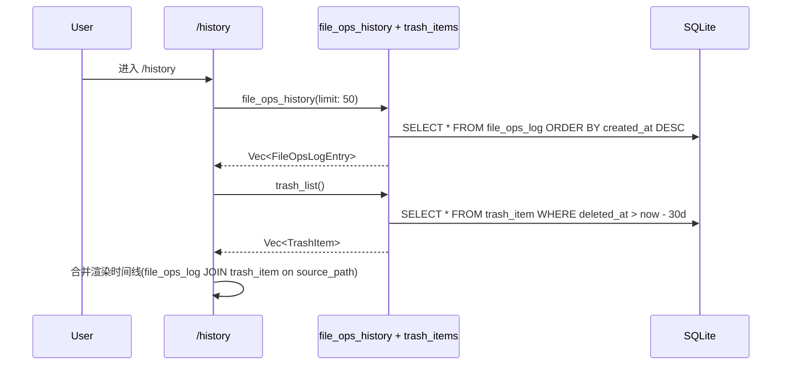

# DiskMind 文件管家 v3.0 设计文档

> Technical Design · Tree-First File Explorer + AI Augmentation
>
> 文档版本:**v3.0** · 撰写日期:2026-05-31 · 状态:Draft for Review
>
> 关联文档:
> - [v3.0 提案(第一性原理推导)](./2026-05-31-05-DiskMind%20文件管家%20v3.0%28Tree-First%20%2B%20AI%20增强%29.md)
> - [v3.0 HTML 原型(9 scene)](./html/2026-05-31-05-DiskMind%20文件管家%20v3.0%28Tree-First%29.html)
> - [技术设计文档(底层架构)](./2026-05-25-02-DiskMind技术设计文档.md)
>
> **v1.0 设计文档(02-04)已清理。v1.0 中已实现的后端 IPC(`file_search` / `file_ops_execute` / `ai_parse_file_intent`)全部复用,本文档 §4.1 有索引。**

---

## 0. 文档定位

本文档是 v3.0 提案(05)被批准后的**正式实施设计**,覆盖:

- 产品定位与差异化
- 信息架构(5 个页面的分工)
- 新增后端模块(explorer IPC、size index、AI tagging engine)
- 复用后端模块(file_search、file_ops、ai_parse 等,引用 v1.0 设计文档)
- 前端组件结构、路由、状态管理
- AI 5 个 Insertion Point 的技术实现
- 数据流(sequence diagram)
- DB Schema 变更
- 安全约束
- 分期实施计划

不在本文档:具体 UI Wireframe(由 v3.0 HTML 原型承接)。

---

## 1. 产品定位与目标

### 1.1 定位(修订)

> DiskMind 不是"AI 替代 Finder",而是"**带空间感知和 AI 增强的跨平台文件管理工具**"。

核心公式:

```
DiskMind v3.0 = Finder 心智模型 + DaisyDisk 空间可视化 + AI inline 增强
```

### 1.2 用户痛点(承接 v1.0 §1.1 + 新增)

| 场景 | 现状痛点 | v3.0 解法 |
|------|----------|----------|
| 找一个老文件 | Finder 搜索慢 / Spotlight 索引失效 | /explorer 搜索框(普通 + NL 双模式) |
| 批量整理下载目录 | 手动拖拽,易漏 | /explorer 多选 + 参数化 ActionConfirmDialog |
| 按规则重命名一批文件 | 需第三方工具 | Inspector 智能动作 → AI 建议重命名 |
| 清理过期临时文件 | 没有可信赖的恢复机制 | /scan 分类建议 + 沙箱 30 天 |
| **看哪个目录占空间最多** | Finder 无法显示累计大小 | **Tree 节点累计大小 + Heatmap 视图** |
| **日常浏览文件夹** | 需要来回切 Finder | **/explorer 三栏布局(与 Finder 一致的心智)** |
| **不知道某个文件夹里都有什么** | Finder 无概览 | **Inspector AI 总结 (P3)** |

### 1.3 目标

- **Tree-First**:用户进入文件管家,第一眼看到的是 tree + list,与 Finder/Explorer 一致
- **空间感知**:tree 节点显示累计大小 + 占比 colorbar;中栏支持 Heatmap 视图
- **AI 边缘增强**:5 个 inline insertion point(P1-P5),从不阻塞浏览
- **复用已有后端**:file_search、file_ops_execute、ai_parse_file_intent 全部复用 v1.0 已实现的 IPC
- **互补页面**:/explorer(浏览) + /scan(清理) + /history(回顾) + /dashboard(概览),一页一心智

### 1.4 非目标(本期不做)

- Finder 全功能替代(不做:拷贝/粘贴/AirDrop/Quick Look 集成等)
- 后台索引服务(MVP 验证后再决定)
- 跨设备同步(纯本地)
- 文件内容搜索(全文检索留下期)
- Grid 视图的缩略图预览(留下期)

---

## 2. 信息架构

### 2.1 Sidebar 导航(最终)

```
◇ 总览          /dashboard      健康概览 + AI 周报
◉ 文件浏览      /explorer       三栏 Tree-First · 默认首页
◇ 扫描清理      /scan           任务导向 · 分类清理建议
◇ 报告          /reports        磁盘报告(已有)
◇ 操作历史      /history        合并沙箱+操作历史
──
◇ 设置          /settings       AI Provider / 偏好
```

### 2.2 页面分工矩阵

| 页面 | 用户心智 | 数据来源 | 主交互 | AI 角色 |
|------|---------|---------|--------|---------|
| `/dashboard` | "硬盘怎么样" | scan cache + file_ops_log | 看概览 + 跳转 | 周报总结 |
| `/explorer` | "看/管理文件" | 实时 `fs::read_dir` + size index | tree + list/grid/heatmap + Inspector | **P1-P5 五个 inline point** |
| `/scan` | "清理磁盘" | scan cache (scan_records) | 分类卡片 + 批量 | 优先级排序 + 解释 |
| `/history` | "做过什么" | file_ops_log + trash_item | 时间线 + 撤销 | 异常聚类 |
| `/settings` | "改配置" | config 表 | 表单 | Provider 设置 |

### 2.3 用户场景(v3.0 修订)

**场景一:日常浏览 + 发现大文件**

1. 用户进入 `/explorer`,默认展示 `~/` tree
2. 展开 `Downloads`,看到 tree 节点旁的 `12.4G` + heatbar(红色 = 空间大户)
3. 点击 `Downloads`,中栏 list 视图加载 234 项,AI 标签列显示每项分类
4. Inspector 显示:总大小/文件数/类型分布 + AI 总结"主要是客户演示资料 + 临时下载"
5. 点击 `[⚡ AI 建议]` 按钮,popover 列出 4 条建议
6. 选中 2 个临时文件 → 操作 ▾ → 删除 → ActionConfirmDialog → 确认 → toast

**场景二:模糊语义搜索(NL)**

1. 在 /explorer 顶部搜索框输入"上个月给客户看的视频"
2. 系统检测到 NL 意图,显示 AI 角标
3. 后端调 `ai_parse_file_intent`,返回结构化条件
4. 弹出 AI 理解卡片(路径/类型/时间/名字),用户点「应用筛选」
5. 中栏 list 切换为搜索结果,展示匹配文件

**场景三:空间可视化**

1. 在 /explorer 切到 Heatmap 视图
2. 看到 DaisyDisk 风格方块,`movies/` 最大(红色)
3. 点击 `movies/` 方块,drill down 到子目录
4. Inspector 显示 AI 总结:"过期素材,建议归档"

**场景四:Chat 内顺手操作(沿用 v1.0 §2.3)**

不变。AiDrawer 内的 `<diskmind-action>` 协议沿用。

---

## 3. 整体架构



---

## 4. 后端设计

### 4.1 复用模块(引用 v1.0 设计文档 §4)

以下 IPC **不做任何修改**,直接复用:

| IPC | 定义位置 | 说明 |
|-----|---------|------|
| `file_search` | `commands/file_search.rs` | WalkDir + glob 实时搜索 |
| `file_ops_execute` | `commands/file_ops.rs` | Move / Rename / Delete 执行 |
| `file_ops_history` | `commands/file_ops.rs` | 操作历史查询 |
| `ai_parse_file_intent` | `commands/ai_file_ops.rs` | NL → 结构化条件 |

Query/Result 结构、安全约束、进度事件等均不变,详见 v1.0 设计文档 §4.1 - §4.4。

### 4.2 新增:Explorer IPC — `commands/explorer.rs`

#### IPC:`explorer_read_dir`

读取指定目录的内容(一层,不递归),附带 size index 缓存。

```rust
pub struct ExplorerReadDirInput {
    pub path: String,
    pub sort_by: ExplorerSortField,   // name | size | mtime | extension
    pub sort_desc: bool,
    pub show_hidden: bool,            // 默认 false
}

#[derive(Debug)]
pub enum ExplorerSortField { Name, Size, Mtime, Extension }

pub struct ExplorerReadDirResult {
    pub entries: Vec<ExplorerEntry>,
    pub total_size: u64,              // 当前目录所有子项累计
    pub total_count: u32,
    pub parent_path: Option<String>,
}

pub struct ExplorerEntry {
    pub path: String,
    pub name: String,
    pub is_dir: bool,
    pub size_bytes: u64,              // 文件: stat size; 目录: size index cache 或 0
    pub mtime: i64,                   // Unix ms
    pub extension: String,
    pub children_count: Option<u32>,  // 目录时有值
    pub ai_tag: Option<String>,       // 如有缓存的 AI 标签则附带
}
```

**实现要点**:

| 要点 | 说明 |
|------|------|
| 读取方式 | `std::fs::read_dir` 单层,不递归 |
| 目录 size | 先查 size index cache;未命中则填 0,前端显示 `—` 并触发异步计算 |
| AI 标签 | 先查 `ai_tag_cache` 表;未命中填 None,前端在 idle 时发起批量标注 |
| 系统路径 | 复用 `is_protected()`,命中的不返回 |
| 排序 | 目录优先,然后按 sort_by 排 |
| 性能 | 2000 项以内 < 50ms;超过则分页(page_size 500,游标翻页) |

#### IPC:`explorer_dir_stats`

计算指定目录的统计信息(递归),用于 Inspector 面板。

```rust
pub struct DirStatsInput {
    pub path: String,
}

pub struct DirStatsResult {
    pub total_size: u64,
    pub file_count: u32,
    pub dir_count: u32,
    pub last_accessed: Option<i64>,   // 最近子文件 atime
    pub type_distribution: Vec<TypeDistEntry>,
    pub largest_children: Vec<LargestEntry>,  // top 5 子项
}

pub struct TypeDistEntry {
    pub category: String,   // "视频" | "文档" | "图片" | "安装包" | "代码" | "其他"
    pub size_bytes: u64,
    pub count: u32,
    pub percentage: f32,
}

pub struct LargestEntry {
    pub name: String,
    pub size_bytes: u64,
    pub is_dir: bool,
}
```

**实现要点**:

| 要点 | 说明 |
|------|------|
| 遍历 | `walkdir` 递归,单线程(IO 瓶颈) |
| 取消 | 用 `CancellationToken`,切换选中目录时取消前一个 |
| 缓存 | 结果写入 size index cache(内存 HashMap);用户触发 fs 操作后 invalidate |
| 文件分类 | 扩展名 → category 映射(硬编码,不走 AI) |
| 性能 | 目标 < 200ms / 2000 文件;大目录 (> 50k 文件) 显示进度条 |

### 4.3 新增:Size Index — `search/size_index.rs`

内存常驻的 `HashMap<PathBuf, u64>`,维护每个目录的累计大小。

```rust
pub struct SizeIndex {
    cache: DashMap<PathBuf, DirSizeEntry>,
}

pub struct DirSizeEntry {
    pub total_bytes: u64,
    pub computed_at: i64,   // Unix ms
    pub child_count: u32,
}
```

**生命周期**:

| 阶段 | 行为 |
|------|------|
| 启动 | 从上次 /scan 的 `scan_records` 聚合填充 top-level 目录 |
| /explorer 展开节点 | 如果 cache miss,后台 spawn `compute_dir_size` 并回填 |
| /scan 完成 | 全量刷新 size index |
| file_ops_execute 成功 | invalidate 受影响路径的所有祖先节点 |
| 过期策略 | `computed_at` 超过 10 分钟的条目视为 stale,下次访问时重算 |

### 4.4 新增:AI Tagging Engine — `ai/tagging.rs`

三级 fallback 的文件分类标签引擎。

```rust
pub struct AiTagRequest {
    pub entries: Vec<TagEntry>,      // 一批文件
    pub context_dir: String,          // 所在目录(给 LLM 上下文)
}

pub struct TagEntry {
    pub path: String,
    pub name: String,
    pub extension: String,
    pub size_bytes: u64,
}

pub struct AiTagResult {
    pub tags: Vec<AiTag>,
}

pub struct AiTag {
    pub path: String,
    pub label: String,              // "客户演示资料" / "疑似可清理" / "工作文档"
    pub category: TagCategory,      // enum: Work / Media / Archive / Temp / Code / Other
    pub source: TagSource,          // Rule / Embedding / LLM
    pub confidence: f32,
}

pub enum TagCategory { Work, Media, Archive, Temp, Code, Other }
pub enum TagSource { Rule, Embedding, LLM }
```

**三级 fallback**:

| 级别 | 覆盖率 | 延迟 | 成本 |
|------|--------|------|------|
| L1 · 规则引擎 | ~80% | < 1ms | 0 |
| L2 · 本地 embedding | ~15% | < 50ms | 0 |
| L3 · LLM | ~5% | 1-3s | API 调用 |

**L1 规则引擎示例**:
- `.DS_Store` / `.tmp` / `__pycache__/` → `Temp`
- `.mp4` / `.mov` / `.mkv` in `~/Movies` → `Media`
- `.pdf` / `.docx` in `~/Documents` → `Work`
- `.dmg` / `.pkg` / `.exe` / `.msi` → `Archive`

**L2 本地 embedding**:路径 + 文件名拼接,用 `sentence-transformers/all-MiniLM-L6-v2`(ONNX)在本地推理,kNN 匹配到预定义 category。

**L3 LLM fallback**:同目录文件合并成一次调用(batch),最多 50 文件/请求。

**缓存**:标签结果写入 `ai_tag_cache` 表(见 §8),path hash 做 key,避免重复调用。

### 4.5 新增:AI Dir Summary — `commands/ai_explorer.rs`

#### IPC:`ai_summarize_dir`

为 Inspector P3 总结指定目录。

```rust
pub struct AiSummarizeDirInput {
    pub path: String,
    pub stats: DirStatsResult,       // 前端先调 explorer_dir_stats 拿到再传入
}

pub struct AiSummarizeDirResult {
    pub summary: String,             // 2-3 句中文总结
    pub suggestions: Vec<String>,    // 建议列表
}
```

走 `AiOrchestrator::chat_once`,scenario = `"dir_summary"`,prompt 见 §5.2。

#### IPC:`ai_dir_suggestions`

为 P5 AI 建议按钮生成建议。

```rust
pub struct AiDirSuggestionsInput {
    pub path: String,
    pub entries: Vec<ExplorerEntry>,  // 当前目录内容(前端传入)
}

pub struct AiDirSuggestionsResult {
    pub suggestions: Vec<DirSuggestion>,
}

pub struct DirSuggestion {
    pub title: String,
    pub description: String,
    pub action_type: String,          // "delete" | "archive" | "rename" | "dedup" | "navigate"
    pub affected_paths: Vec<String>,
    pub estimated_savings: Option<u64>,
    pub priority: u8,                 // 1-5, 1 最高
}
```

### 4.6 复用:DB Schema(v1.0 §4.4 + v3.0 扩展)

v1.0 新增的 `file_ops_log` 表不变。v3.0 新增两个表:

```sql
-- AI 标签缓存
CREATE TABLE IF NOT EXISTS ai_tag_cache (
    id          INTEGER PRIMARY KEY AUTOINCREMENT,
    path_hash   TEXT    NOT NULL UNIQUE,   -- blake3(path)
    path        TEXT    NOT NULL,
    label       TEXT    NOT NULL,
    category    TEXT    NOT NULL,
    source      TEXT    NOT NULL,          -- 'rule' | 'embedding' | 'llm'
    confidence  REAL    NOT NULL DEFAULT 1.0,
    created_at  INTEGER NOT NULL,
    expires_at  INTEGER NOT NULL           -- created_at + 7 天(文件名变则 invalidate)
);

CREATE INDEX IF NOT EXISTS idx_ai_tag_cache_hash
    ON ai_tag_cache(path_hash);

-- AI 目录总结缓存
CREATE TABLE IF NOT EXISTS ai_dir_summary_cache (
    id          INTEGER PRIMARY KEY AUTOINCREMENT,
    dir_path    TEXT    NOT NULL UNIQUE,
    summary     TEXT    NOT NULL,
    suggestions TEXT,                      -- JSON array
    dir_mtime   INTEGER NOT NULL,          -- 目录 mtime,变了就 invalidate
    created_at  INTEGER NOT NULL
);
```

DATA_VERSION 从 15 升到 **16**。迁移逻辑:`CREATE TABLE IF NOT EXISTS`。

---

## 5. AI Prompt 设计

### 5.1 `FILE_OPS_SYSTEM`(复用 v1.0 §5.1)

不变。用于 P2 NL 搜索的 `ai_parse_file_intent` 场景。

### 5.2 `DIR_SUMMARY_SYSTEM`(新增)

用于 P3 文件夹 AI 总结。

**核心契约**:
- 输入:目录路径 + DirStatsResult(大小/文件数/类型分布/top 5 子项)
- 输出:JSON `{ summary: string, suggestions: string[] }`
- 语言:中文
- 风格:2-3 句话,简洁有行动导向
- 禁止:不编造文件名,只基于输入数据

**关键设计**:
- `json_mode = true`,max_tokens = 512
- 超时 5s,fallback 返回空 summary + 前端显示"AI 总结不可用"
- 缓存:同目录 mtime 不变时复用缓存

### 5.3 `DIR_SUGGEST_SYSTEM`(新增)

用于 P5 AI 建议 popover。

**核心契约**:
- 输入:目录路径 + 文件列表(名字/扩展名/大小/mtime)
- 输出:JSON `{ suggestions: [{ title, description, action_type, affected_paths, estimated_savings, priority }] }`
- 建议数量:最多 5 条,按 priority 排序
- action_type 限定:`"delete"` / `"archive"` / `"rename"` / `"dedup"` / `"navigate"`

### 5.4 扩展 `CHAT_SYSTEM`(沿用 v1.0 §5.2)

`<diskmind-action>` 协议新增 `type: "navigate"`:

| type | 字段 | 用途 |
|------|------|------|
| `navigate` | `path: string` | AI 建议跳转到 /explorer 并定位到指定目录 |

其他 type(search / move / rename / delete)不变。

---

## 6. 前端设计

### 6.1 路由

```typescript
// router/index.ts — v3.0 变更
const routes = [
  { path: '/', redirect: '/dashboard' },
  { path: '/dashboard',  component: () => import('@/pages/dashboard/index.vue') },
  { path: '/explorer',   component: () => import('@/pages/explorer/index.vue'),
    meta: { titleKey: 'nav.explorer' } },           // ← 新增
  { path: '/scan',       component: () => import('@/pages/scan/index.vue') },      // 已有
  { path: '/reports',    component: () => import('@/pages/reports/index.vue') },    // 已有
  { path: '/history',    component: () => import('@/pages/history/index.vue'),
    meta: { titleKey: 'nav.history' } },             // ← 新增(替代 /trash)
  { path: '/settings',   component: () => import('@/pages/settings/index.vue') },  // 已有
]
// 删除: /file-manager 路由
// 删除: /trash 路由(合并到 /history)
```

### 6.2 Sidebar

```typescript
// AppSidebar.vue — mainNav 更新
const mainNav = [
  { title: t('nav.dashboard'), to: '/dashboard',  icon: LayoutDashboard },
  { title: t('nav.explorer'),  to: '/explorer',   icon: FolderOpen,
    badge: 'default' },                         // ← 新增,标记"默认"
  { title: t('nav.scan'),      to: '/scan',       icon: Search,
    badge: scanStore.candidateCount },           // 已有
  { title: t('nav.reports'),   to: '/reports',    icon: FileText },
  { title: t('nav.history'),   to: '/history',    icon: Clock,
    badge: historyStore.recoverableCount },       // ← 新增(替代 trash badge)
]
```

**i18n key**:
- `nav.explorer`:`文件浏览` / `File Explorer`
- `nav.history`:`操作历史` / `History`

### 6.3 /explorer 组件结构

```
pages/explorer/
  index.vue                     -- 三栏布局编排 + Pinia store 连接
  components/
    TreePane.vue                -- 左栏:文件夹 tree + 收藏 + 智能集合
    TreeNode.vue                -- tree 单个节点(递归,含 size + heatbar)
    TreeHoverTooltip.vue        -- P1: hover 时的 AI 提示 tooltip
    ListPane.vue                -- 中栏:list/grid/heatmap 视图容器
    FileListView.vue            -- list 视图(table 行 + AI 标签列)
    FileGridView.vue            -- grid 视图
    HeatmapView.vue             -- heatmap 视图(DaisyDisk 方块)
    ListToolbar.vue             -- 中栏顶部工具栏(导航/视图切换/AI 建议)
    InspectorPane.vue           -- 右栏:元数据 + 预览 + AI panel
    InspectorDirPanel.vue       -- Inspector: 选中目录时的面板
    InspectorFilePanel.vue      -- Inspector: 选中文件时的面板
    AiSummaryCard.vue           -- P3: AI 总结卡片
    AiTagBadge.vue              -- P4: AI 标签 badge
    AiSuggestPopover.vue        -- P5: AI 建议 popover
    SearchBar.vue               -- P2: 顶部搜索框(普通 + NL 双模式)
    NlParseCard.vue             -- P2: NL 解析后的条件展示卡片
    SelectionBar.vue            -- 底部选中操作栏
  store.ts                      -- Pinia store
```

### 6.4 Pinia Store — `stores/explorer.ts`

```typescript
interface ExplorerState {
  // Tree state
  currentPath: string            // 当前展示的目录
  treeExpandedPaths: Set<string> // 展开的节点
  favorites: string[]            // 收藏目录

  // List state
  entries: ExplorerEntry[]       // 当前目录内容
  viewMode: 'list' | 'grid' | 'heatmap'
  sortBy: 'name' | 'size' | 'mtime' | 'extension'
  sortDesc: boolean
  showHidden: boolean
  loading: boolean

  // Selection
  selectedPaths: Set<string>     // 多选
  inspectedPath: string | null   // Inspector 展示的项

  // Inspector data
  dirStats: DirStatsResult | null
  aiSummary: { summary: string; suggestions: string[] } | null
  aiSummaryLoading: boolean

  // Search
  searchQuery: string
  searchMode: 'normal' | 'nl'
  searchResults: FileSearchEntry[] | null

  // AI tags (batch loaded)
  aiTags: Map<string, AiTag>
  aiTagsLoading: boolean
}
```

**关键 action**:

| Action | 触发时机 | 行为 |
|--------|---------|------|
| `navigateTo(path)` | 点击 tree 节点 / breadcrumb | 更新 currentPath → 调 `explorer_read_dir` → 填充 entries |
| `loadDirStats(path)` | 选中目录 | 调 `explorer_dir_stats` → 填充 dirStats |
| `loadAiSummary(path)` | 选中目录 + dirStats 已有 | 调 `ai_summarize_dir` → 填充 aiSummary |
| `loadAiTags(entries)` | navigateTo 完成后 idle 1s | 调 `ai_tag_batch` → 填充 aiTags Map |
| `executeSearch(query)` | 搜索框 Enter | 检测 NL? → `ai_parse_file_intent` : `file_search` |
| `performAction(type, paths)` | SelectionBar 操作菜单 | 打开 ActionConfirmDialog |

### 6.5 ActionConfirmDialog(参数化,v2.0 提议落地)

改造已有的三个 Dialog(MoveDialog / RenameDialog / DeleteConfirm)为一个参数化组件。

```typescript
// components/dialogs/ActionConfirmDialog.vue
interface Props {
  open: boolean
  mode: 'move' | 'rename' | 'delete'
  items: Array<{ path: string; size?: number; newName?: string }>
  destination?: string
  aiQuery?: string
}
```

内部用 `<component :is="ParamsByMode[mode]" />` 渲染:
- `mode=move`:显示目标目录 picker + 常用列表 + 跨磁盘警告
- `mode=rename`:显示规则 RadioGroup + 预览
- `mode=delete`:显示沙箱说明 + 触发文本 quote

### 6.6 /history 组件结构

```
pages/history/
  index.vue                    -- 时间线 + 筛选 tabs
  components/
    HistoryTimeline.vue        -- 操作记录时间线
    HistoryItem.vue            -- 单条记录(含沙箱子状态)
    UndoBanner.vue             -- 顶部可撤销提示 banner
```

**沙箱状态嵌入**:删除类操作的每条记录显示沙箱子状态:

| 子状态 | 条件 | 颜色 | 动作 |
|--------|------|------|------|
| `pending` | 沙箱内 > 7 天可用 | 默认 | `[↺ 恢复]` |
| `expiring` | < 7 天 | warning 黄 | `[↺ 恢复(剩 X 天)]` |
| `urgent` | < 24h | danger 红 | `[↺ 立即恢复]` |
| `expired` | 已清理 | muted | `已永久删除`(无 action) |

### 6.7 撤销机制 · 两段式接力

```
T+0s        操作完成 → 底部 toast(10s,"[↺ 撤销]")
T+10s       toast 消失 → 顶部 UndoBanner("今天有 N 项可撤销 → [查看]")
T+用户关闭  UndoBanner 隐藏 → localStorage 标记 24h 不再显示
T+any       /history 永远可恢复(沙箱 30 天)
```

---

## 7. 数据流

### 7.1 /explorer 浏览流程



### 7.2 P2 · NL 搜索流程



### 7.3 批量操作流程(沿用 v1.0 §7.2)

不变。ActionConfirmDialog → `file_ops_execute` → Toast/Banner。

### 7.4 /history 查询流程



---

## 8. DB Schema 变更汇总

### v1.0 已有(DATA_VERSION 15)

```sql
-- file_ops_log (v1.0 新增,不变)
CREATE TABLE IF NOT EXISTS file_ops_log (
    id, op_type, source_path, dest_path, size_bytes,
    status, error_message, ai_query, created_at
);
```

### v3.0 新增(DATA_VERSION 16)

```sql
-- AI 标签缓存
CREATE TABLE IF NOT EXISTS ai_tag_cache (
    id          INTEGER PRIMARY KEY AUTOINCREMENT,
    path_hash   TEXT    NOT NULL UNIQUE,
    path        TEXT    NOT NULL,
    label       TEXT    NOT NULL,
    category    TEXT    NOT NULL,
    source      TEXT    NOT NULL,
    confidence  REAL    NOT NULL DEFAULT 1.0,
    created_at  INTEGER NOT NULL,
    expires_at  INTEGER NOT NULL
);
CREATE INDEX IF NOT EXISTS idx_ai_tag_cache_hash ON ai_tag_cache(path_hash);

-- AI 目录总结缓存
CREATE TABLE IF NOT EXISTS ai_dir_summary_cache (
    id          INTEGER PRIMARY KEY AUTOINCREMENT,
    dir_path    TEXT    NOT NULL UNIQUE,
    summary     TEXT    NOT NULL,
    suggestions TEXT,
    dir_mtime   INTEGER NOT NULL,
    created_at  INTEGER NOT NULL
);
```

迁移逻辑:在 `db/mod.rs` 的 `ensure_tables()` 中用 `CREATE TABLE IF NOT EXISTS` + bump `DATA_VERSION`。

---

## 9. 安全约束总览

| 风险 | 防护 | 来源 |
|------|------|------|
| 误删系统文件 | `is_protected()` 黑名单 + Delete 强制走沙箱 | v1.0 ✅ |
| AI 幻觉路径 | `file_ops_execute` 入口校验路径存在 | v1.0 ✅ |
| 移动覆盖已有文件 | 目标存在则报 `target exists` | v1.0 ✅ |
| 重命名注入 `../` | `new_name` 不允许路径分隔符 | v1.0 ✅ |
| 长时间搜索卡死 | `cancel_flag` + `max_results` 上限 | v1.0 ✅ |
| 跨卷移动失败 | `rename` 失败 → copy + `force_remove` + 记 log | v1.0 ✅ |
| **AI 标签成本失控** | **L1 规则引擎 80% + 单会话 < 50 LLM 调用** | v3.0 新增 |
| **Size index 不一致** | **fallback: stale 10min → 重算; fs 操作后 invalidate** | v3.0 新增 |
| **explorer_read_dir 大目录** | **分页(500/页) + UI 虚拟滚动** | v3.0 新增 |
| **AI 总结内容不当** | **Prompt 约束"只基于输入数据" + 不展示文件内容** | v3.0 新增 |

---

## 10. 关键决策

| 决策 | 选择 | 理由 |
|------|------|------|
| /explorer 为默认首页 | ✅ | 用户心智 = Finder;浏览是日常,清理是偶发 |
| AI 角色 = inline 增强 | ✅ | AI 阻塞浏览 = 负体验;参考 GitHub Copilot 模式 |
| Tree 节点显示累计大小 | ✅ | Finder 没有,这是核心差异化 |
| Size index 用内存 HashMap | ✅ | 启动从 scan cache 填充;不需要持久化到独立表 |
| AI 标签三级 fallback | ✅ | 规则引擎成本为 0 且覆盖 80%;LLM 只兜底 5% |
| ActionConfirmDialog 合并 | ✅ | 减少代码重复;用户只需学一个交互模式 |
| /trash 合并到 /history | ✅ | "我做了什么"是同一个问题;沙箱作为删除操作的子状态 |
| 撤销 toast + banner 接力 | ✅ | toast 10s 兜底"刚做完反悔";banner 兜底"10 分钟后想起" |
| Heatmap 视图 Phase 3 | ✅ | 差异化杀手功能但可独立交付;MVP 先 list + grid |
| 复用 v1.0 后端 IPC | ✅ | file_search / file_ops / ai_parse 已实现且通过 cargo check |

---

## 11. 分期实施

### Phase 1 · MVP /explorer(2 周)

| # | 任务 | 文件/模块 | 复杂度 |
|---|------|---------|-------|
| 1 | 新增 `explorer_read_dir` + `explorer_dir_stats` IPC | `commands/explorer.rs` | M |
| 2 | Size Index 内存缓存 | `search/size_index.rs` | M |
| 3 | /explorer 三栏布局 + TreePane + ListPane (list 视图) | `pages/explorer/*` | L |
| 4 | InspectorPane 元数据面板(不含 AI) | `InspectorDirPanel.vue` / `InspectorFilePanel.vue` | M |
| 5 | 路由 + Sidebar + i18n | `router/index.ts` / `AppSidebar.vue` | XS |
| 6 | SelectionBar + 集成 ActionConfirmDialog | `SelectionBar.vue` / `ActionConfirmDialog.vue` | S |

### Phase 2 · AI 增强(2 周)

| # | 任务 | 文件/模块 | 复杂度 |
|---|------|---------|-------|
| 7 | AI 标签规则引擎(L1) | `ai/tagging.rs` | S |
| 8 | AI 标签 LLM fallback(L3) + `ai_tag_cache` 表 | `ai/tagging.rs` / `db/mod.rs` | M |
| 9 | P1 Tree hover tooltip | `TreeHoverTooltip.vue` | S |
| 10 | P3 Inspector AI 总结 + `ai_summarize_dir` IPC | `AiSummaryCard.vue` / `commands/ai_explorer.rs` | M |
| 11 | P4 文件 AI 标签列 | `AiTagBadge.vue` / `FileListView.vue` | S |
| 12 | `ai_dir_summary_cache` 表 | `db/mod.rs` | XS |

### Phase 3 · 高级视图 + 搜索(2 周)

| # | 任务 | 文件/模块 | 复杂度 |
|---|------|---------|-------|
| 13 | Heatmap 视图 | `HeatmapView.vue` | L |
| 14 | Grid 视图 | `FileGridView.vue` | M |
| 15 | P2 NL 搜索切换 + NlParseCard | `SearchBar.vue` / `NlParseCard.vue` | M |
| 16 | P5 AI 建议 popover + `ai_dir_suggestions` IPC | `AiSuggestPopover.vue` / `commands/ai_explorer.rs` | M |

### Phase 4 · 收尾(1 周)

| # | 任务 | 文件/模块 | 复杂度 |
|---|------|---------|-------|
| 17 | /history 页面(合并沙箱 + 操作历史) | `pages/history/*` | M |
| 18 | UndoBanner 接力组件 | `UndoBanner.vue` | S |
| 19 | /dashboard 简化(AI 周报 + Top 5) | `pages/dashboard/index.vue` 改造 | S |
| 20 | 删除 /file-manager 路由 + /trash 路由 + i18n 清理 | 多处 | XS |
| 21 | DB 迁移 DATA_VERSION 15 → 16 | `db/mod.rs` | XS |

**合计:7-8 周(单人)**。

---

## 12. 待确认事项

1. **Phase 0 产品对齐**:是否需要在开发前与 PM/Marketing 确认"AI 文件管家"品牌话术调整?
2. **L2 本地 embedding**:是否要捆绑 ONNX 模型到安装包(增加约 80MB)?还是先跳过 L2,只用 L1+L3?
3. **Heatmap 实现**:用 Canvas 2D / SVG / 第三方库(如 d3-treemap)?性能 vs 开发成本权衡
4. **Smart Collection(智能集合)**:tree 左栏的"大文件/临时/旧文件/重复"虚拟文件夹,数据来源是 scan cache 还是实时查询?
5. **/history 数据合并**:`file_ops_log` 和 `trash_item` 的 JOIN 方式 — 按 `source_path` 关联还是按时间窗口?
6. **AI 标签列可见性**:默认显示还是默认隐藏,用户在列头右键切换?

---

## 附录 A:已实现代码索引

### v1.0 已实现(全部复用)

| 文件 | 状态 |
|------|------|
| `commands/file_search.rs` | 复用 |
| `commands/file_ops.rs` | 复用 |
| `commands/ai_file_ops.rs` | 复用 |
| `db/file_ops.rs` | 复用 |
| `scanner/mod.rs` (`is_search_skip`) | 复用 |
| `trash/mod.rs` (`force_remove` pub) | 复用 |
| `ai/prompts.rs` (`FILE_OPS_SYSTEM`) | 复用 |
| `db/mod.rs` (`file_ops_log` 表) | 复用 |
| `api/tauri.ts` (6 个 API 绑定) | 复用 |

### v3.0 需新增

| 文件 | 状态 |
|------|------|
| `commands/explorer.rs` | 待实现 |
| `commands/ai_explorer.rs` | 待实现 |
| `search/size_index.rs` | 待实现 |
| `ai/tagging.rs` | 待实现 |
| `ai/prompts.rs` (`DIR_SUMMARY_SYSTEM` / `DIR_SUGGEST_SYSTEM`) | 待实现 |
| `db/mod.rs` (`ai_tag_cache` + `ai_dir_summary_cache` 表) | 待实现 |
| `pages/explorer/*` (全部组件) | 待实现 |
| `pages/history/*` (全部组件) | 待实现 |
| `components/dialogs/ActionConfirmDialog.vue` (重构) | 待实现 |
| `stores/explorer.ts` | 待实现 |

---

## Changelog

| 版本 | 日期 | 变更 |
|------|------|------|
| v3.0 | 2026-05-31 | 基于 v3.0 提案(05)编写正式技术设计。核心:Tree-First 三栏 /explorer 作为默认首页;AI 拆为 5 个 inline insertion point;AI 标签三级 fallback;Size Index 内存缓存;ActionConfirmDialog 参数化合并;/history 合并沙箱+操作历史;撤销 toast+banner 两段式。复用 v1.0 全部后端 IPC,新增 4 个 IPC + 2 个 DB 表。Phase 1-4 共 7-8 周。 |
